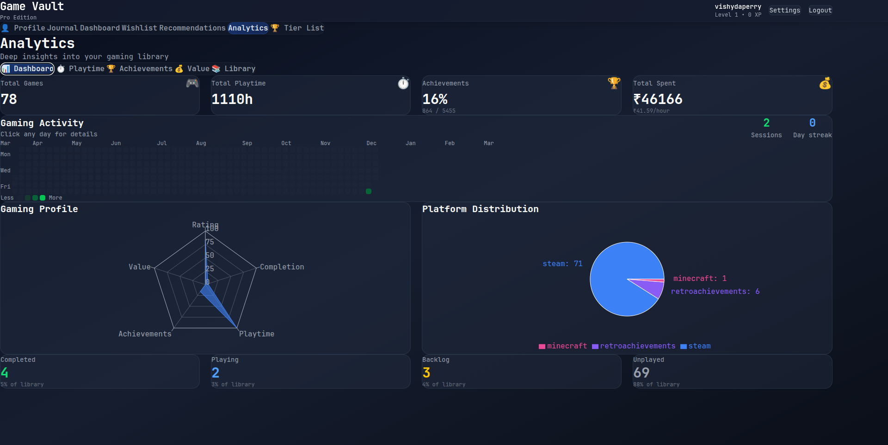
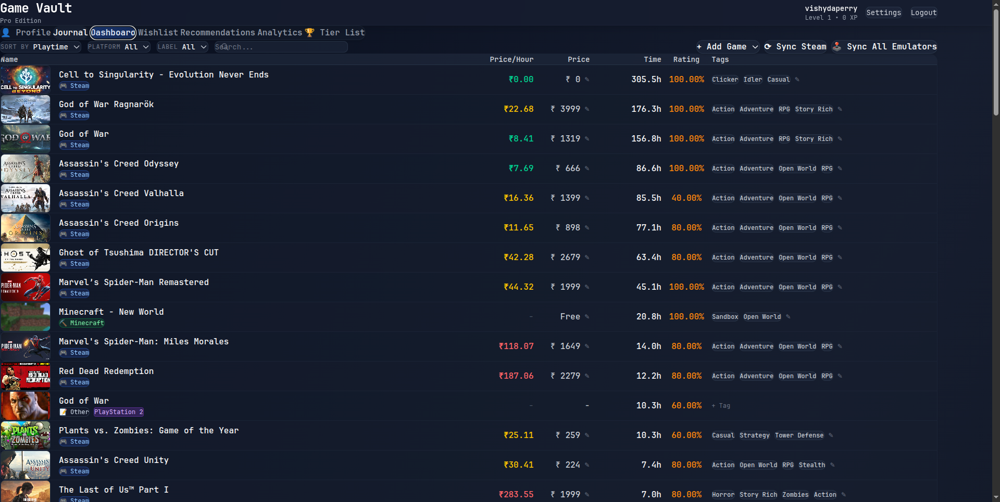
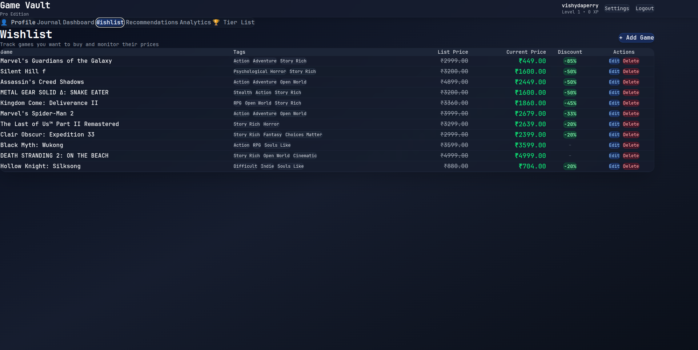
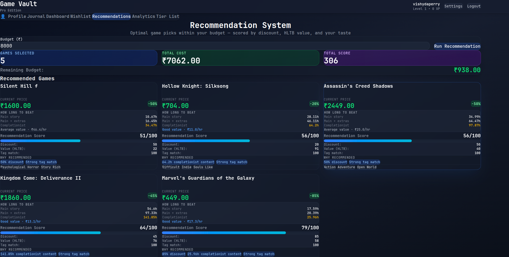

# Game Vault

**Track. Analyze. Optimize your Steam library.**

A full-stack web app that turns your Steam library into an analytics-driven dashboard — with session tracking, HowLongToBeat estimates, and intelligent budget recommendations.


> ⚠️ Not affiliated with Valve, Steam, HowLongToBeat, or any other platform mentioned.

---

## What is this?

Steam tells you how long you've played, but not whether that time was worth it. Game Vault aggregates your library into a single dashboard with GitHub-style activity heatmaps, value analytics, and smart wishlist recommendations.

Every integration is a remote HTTP API, so the app runs entirely server-side and deploys anywhere — no local file access required.

---

## Key Features

- **Steam library sync** — Playtime, achievements, prices, and tags pulled straight from the Steam Web API
- **HowLongToBeat integration** — Main story, main + extras, and completionist estimates on every game
- **Smart recommendations** — 0/1 knapsack algorithm scored by discount, HLTB hrs/₹ value, and your taste profile
- **Advanced analytics** — GitHub-style heatmap, session tracking, radar chart, price-per-hour
- **Unified journal** — Notes and progress logs for every game in your library

---

## Screenshots

### Analytics Dashboard


### Game Library


### Wishlist


### Recommendations


---

## Quick Start

```bash
# 1. Clone
git clone https://github.com/Vishrut2403/GameVault.git
cd GameVault

# 2. Backend
cd backend
npm install
cp .env.example .env   # fill in your keys
npx prisma migrate dev
npm run dev

# 3. Frontend (new terminal)
cd frontend
npm install
cp .env.example .env   # set VITE_API_URL=http://localhost:3001
npm run dev
```

Open **http://localhost:5173**

> You'll need Node.js 18+, PostgreSQL 14+, and a Steam API key to get started.
> See [docs/setup.md](./docs/setup.md) for the full setup guide.

---

## Tech Stack

| Layer | Tech |
|---|---|
| Frontend | React 18, TypeScript, Vite, TailwindCSS, Recharts |
| Backend | Node.js, Express, TypeScript |
| Database | PostgreSQL 14+, Prisma ORM |
| Auth | JWT, Passport.js (Steam OAuth) |
| Integrations | Steam API, HowLongToBeat (unofficial API) |

---

## Documentation

- [Setup Guide](./docs/setup.md) — prerequisites, env vars, database, running locally
- [Features](./docs/features.md) — detailed breakdown of every feature
- [Integrations](./docs/integrations.md) — Steam, HLTB
- [Troubleshooting](./docs/troubleshooting.md) — common errors and fixes
- [API Reference](./docs/api.md) — all backend endpoints

---

## Author

**Vishrut Sachan**
- GitHub: [@Vishrut2403](https://github.com/Vishrut2403)
- Project: [GameVault](https://github.com/Vishrut2403/GameVault)

---

## Disclaimer

This project is not affiliated with Valve, Steam, HowLongToBeat, or any other platform mentioned. HLTB data is fetched via an unofficial third-party API and may not always be complete or accurate.